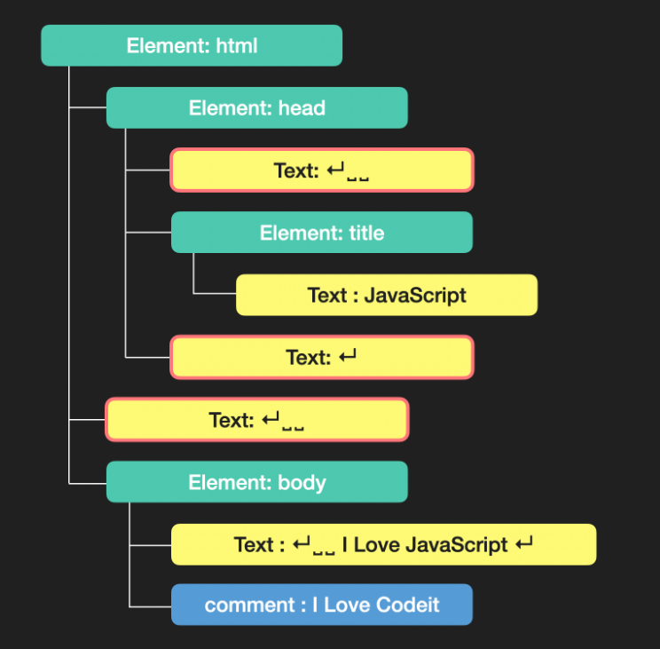

## 요소 노드에 대한 이동 프로퍼티

|프로퍼티|유형|결과|
|-----|----|----|
|element.children|자식 요소 노드|element의 자식 요소 모음(HTMLCollection)|
|element.firstElementChild|자식 요소 노드|element의 첫 번째 자식 요소 하나|
|element.lastElementChild|자식 요소 노드|element의 마지막 자식 요소 하나|
|element.parentElement|부모 요소 노드|element의 부모 요소 하나|
|element.previousElementSibling|형제 요소 노드|element의 이전(previous) 혹은 좌측(left)에 있는 요소 하나|
|element.nextElementSibling|형제 요소 노드|element의 다음(next) 혹은 우측(right)에 있는 요소 하나|

## 모든 노드에 대한 이동 프로퍼티

|프로퍼티|유형|결과|
|node.childNodes|자식 노드|node의 자식 노드 모음(NodeList)|
|node.firstChild|자식 노드|node의 첫 번째 자식 노드 하나|
|node.lastChild|자식 노드|node의 마지막 자식 노드 하나|
|node.parentNode|부모 노드|node의 부모 요소 하나|
|node.previousSibling|형제 노드|node의 이전(previous) 혹은 좌측(left)에 있는 노드 하나|
|node.nextSibling|형제 노드|node의 다음(next) 혹은 우측(right)에 있는 노드 하나|

## DOM 트리를 구성할 때..
- 브라우저가 HTML 코드를 해석할 때 각 코드들은 상황에 맞게 node를 생성하고 DOM 트리를 구성하는데,

- HTML 태그는 요소 노드가 되고, 
- 문자들은 텍스트 노드,
- 그리고 주석도 주석 노드로 DOM 트리에 반영됩니다.
```js
<!DOCTYPE HTML>
<html>
<head>
  <title>JavaScript</title>
</head>
<body>
  I Love JavaScript
  <!-- I Love Codeit -->
</body>
</html>
```
예를 들어 이런 코드는 아래와 같이 DOM 트리를 구성하게 되는데요.



- 그런데 텍스트 노드 중에서 붉은 테두리가 있는 부분을 통해 알 수 있듯 태그와 태그사이에 줄 바꿈과 들여쓰기로 인한 띄어쓰기도 텍스트 노드(Text라고 표시된 부분)로 생성된 모습을 확인할 수 있습니다.

- 지금 예시는 간단하기 때문에 어느 정도 DOM 트리를 예상할 수 있지만, 조금만 더 코드가 복잡하거나 혹은 코드의 스타일이 일정하지 않은 경우에는 이런 줄 바꿈과 들여쓰기로 인해 생성된 텍스트 노드의 존재를 파악하기가 쉽지 않을 수 있습니다.

- 그래서 방금 본, 모든 노드가 공통으로 갖고 있는 프로퍼티를 활용한다면, 예상치 못한 텍스트 노드를 선택하게 되어 의도하지 않은 결과를 만들어 낼 가능성이 커지게 됩니다.
